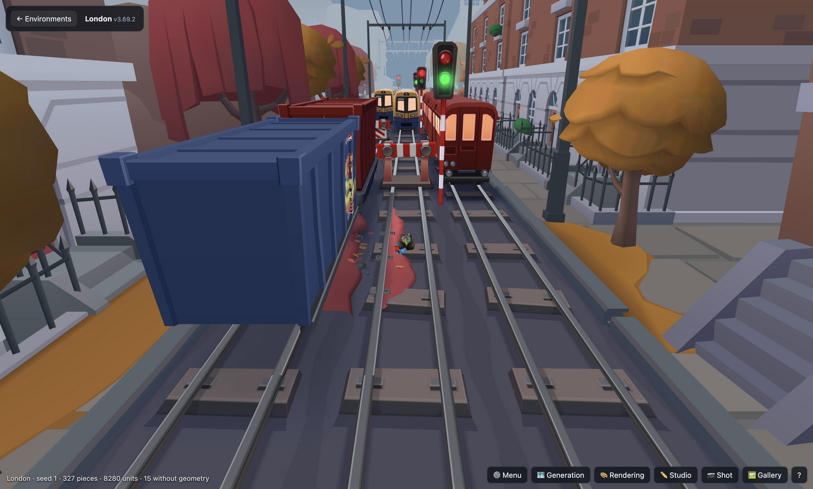
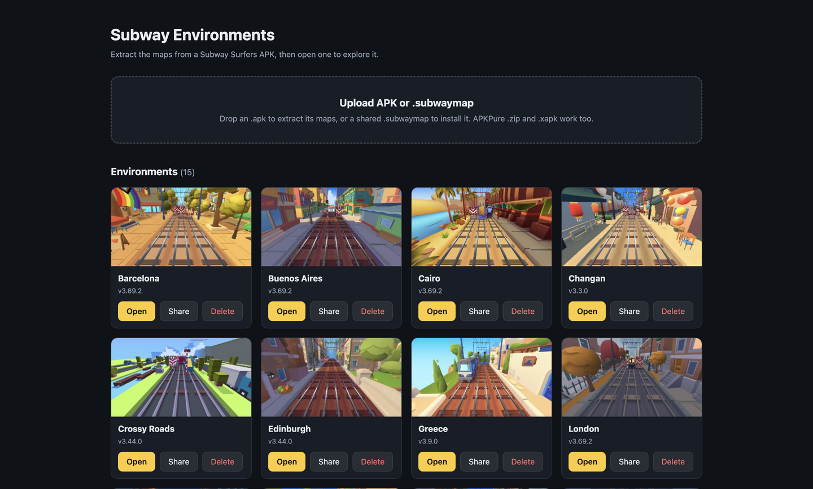
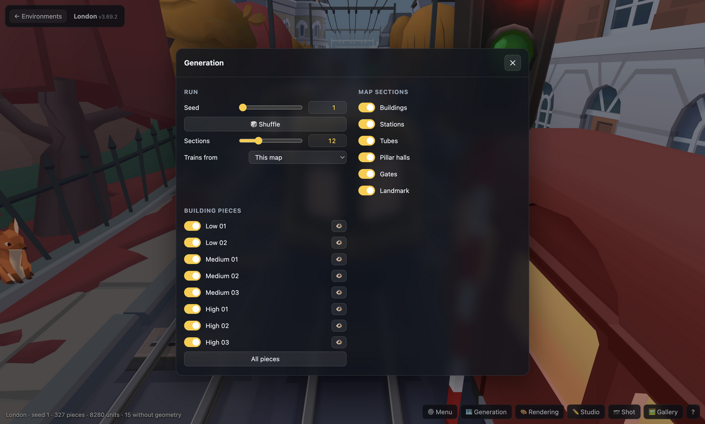
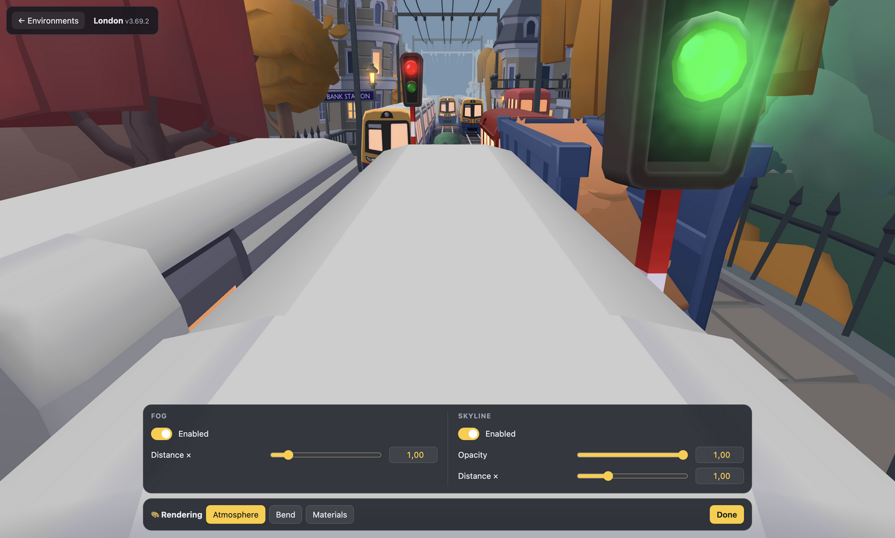
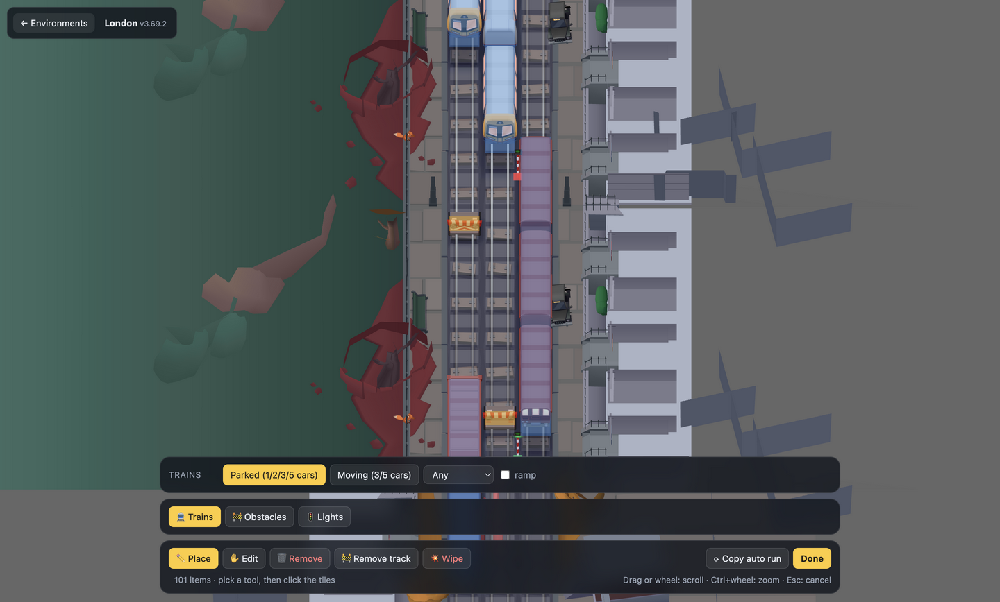
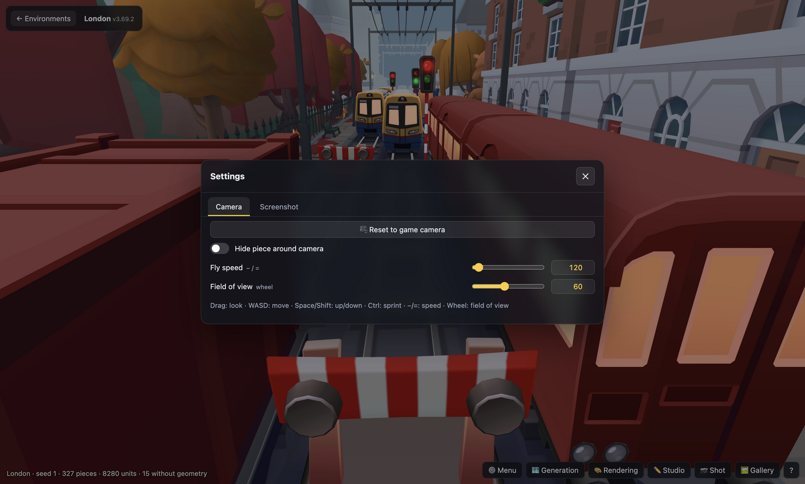
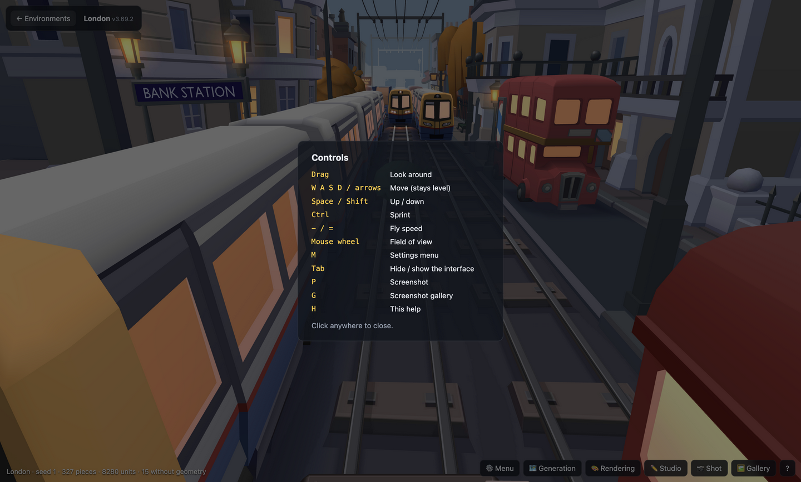

# Subway Assets Renderer

Environment viewer for Subway Surfers maps. Upload an APK, and each map it contains becomes an environment you can explore: the city laid out as a run, with trains, obstacles and signal lights as toggleable layers.

No game assets are included in this repo. Everything is extracted locally from your own game package.



| Home: your maps | Generation |
|---|---|
|  |  |
| **Rendering** | **Studio** |
|  |  |
| **Settings** | **Controls (H)** |
|  |  |

## Download

Get the app for your OS from the [Releases](https://github.com/CelianF/subway-assets-renderer/releases) page. Nothing else to install.

- **macOS** (`.dmg`, `arm64` for Apple Silicon, `x64` for Intel): signed and notarized, open it and drag the app to Applications.
- **Windows** (`.exe`): the installer is not signed. When SmartScreen warns, click *More info* → *Run anyway*.
- **Linux** (`.AppImage`): `chmod +x Subway-Assets-Renderer-*.AppImage`, then run it.

## Development setup

Requirements: Node 20+ and the [.NET 10 SDK](https://dotnet.microsoft.com/download/dotnet/10.0) to build the extractor. Works on macOS, Windows and Linux.

```sh
git clone --recursive https://github.com/CelianF/subway-assets-renderer
cd subway-assets-renderer
npm run setup        # builds the extractor + installs the viewer
npm run dev          # http://localhost:5173
```

`npm run setup -- --self-contained` builds an extractor for the current OS that runs without the .NET runtime (`dist/ripper-<arch>/`, add `--arch x64|arm64` to pick the architecture).

### Desktop app

```sh
npm run setup -- --self-contained   # the app bundles the self-contained extractor
npm run app                          # run it with Electron
npm run dist                         # package it for this OS into release/
```

The app keeps its maps in a "Subway Assets Renderer" folder: `~/Library/Application Support/` on macOS, `%LOCALAPPDATA%` on Windows, `~/.config/` on Linux.

## Using it

1. **Home page**: drop one or more `.apk` files (APKPure `.zip` and `.xapk` work too). They queue and extract one after the other, a few minutes each; waiting ones can be removed from the queue. Each map becomes an environment card with Open and Delete.
   If a map with the same name and game version is already installed, a dialog asks per map: **Ignore** (keep the existing one), **Keep both** (the new one is saved as a copy, with an optional note shown on its card, e.g. "Pride event") or **Replace**. Variants of a city (e.g. an event skin) are separate maps and never collide.
2. **Sharing**: *Share* on a card downloads a `.subwaymap` file. Drop it on someone else's home page to install the map, with no APK or extraction needed. A `.subwaymap` is a plain zip of the environment folder plus a `subwaymap.json` header.
3. **Viewer**: fly around the map. *← Environments* goes back to pick another map.
   - Drag to look, WASD to move, Space/Shift for up/down, Ctrl to sprint, −/= for fly speed, mouse wheel for field of view. **M** opens the settings menu, **Tab** hides the interface, P takes a screenshot, H shows help (add `?debug=true` to the URL for the piece browser, B).
   - **Settings menu**: generation (seed, sections, which section types, trains, obstacles, decorations and signals to generate, density), layers, rendering (fog, skyline opacity/distance, glass, bend), camera and screenshots.
   - **Studio**: a top view of the run with placement spots. Draw trains from a start cell to an end cell (the longest train that fits is used), drop obstacles, power boxes, pillars and signal lights, or remove them. It can start from the auto-generated run. Placements are saved per map in the browser.

## Pipeline

```
APK ──tools/ripper (headless AssetRipper)──▶ Unity project + glb export   (temporary, ~2 GB)
    ──tools/build_manifest.mjs --split─────▶ workspace/envs/<Map>_<version>/  (manifest.json, glb/, mesh/, tex/)
    ──viewer (Vite + three.js)──────────────▶ browser
```

- `tools/ripper/`: a small .NET CLI on top of the AssetRipper libraries (pinned as the `third_party/AssetRipper` submodule). The default build is framework-dependent, so a single build runs on macOS, Windows and Linux. CI (`.github/workflows/ripper.yml`) also produces self-contained builds for macOS arm64/x64 and Windows x64.
- `server/api.js`: upload, extraction queue (one job at a time), environment list and delete. It is mounted on the Vite dev server, `server/index.js` serves the production build (`npm start`), and `app/main.mjs` runs that server inside the desktop app.
- `tools/build_manifest.mjs`: runs in a worker thread of the server, and can also be run by hand on an AssetRipper export (`node tools/build_manifest.mjs <export> --split --out <dir>`).

## How the game's data maps to the viewer

- **Themes** (`<City>_Theme.asset`) map *slot types* (`boundary_high_left`, `train_static_3`, …) to prefab variants. Themes inherit from `_Common_Theme`.
- **Boundaries** (`<City>_Boundaries.asset`): transition pieces such as tube entrances, plus which stretches show track shadows.
- **Theme config** (`<City>_Config.asset`): fog color and distances, skybox gradient, skyline.
- **Grid** (`WorldConstants`): 3 lanes × 20 units, cells 11.25 deep, so a boundary segment is 180 deep.
- **Prefab runtime behaviour**, emulated by the viewer: `RandomChildRandomizer` (one variant per group), `LODGroup` (LOD0 only), TrackController (per-type rail meshes).
- **Shaders**: `SYBO/Bend/*` keep only their property blocks in the export and are reimplemented in `viewer/src/materials.js`. The math is done in gamma space, like the Unity project.
- **Layout**: route generation is stripped from the export, so `viewer/src/layout.js` generates plausible runs. Obstacles can also follow the game's 30 chase chunks.
